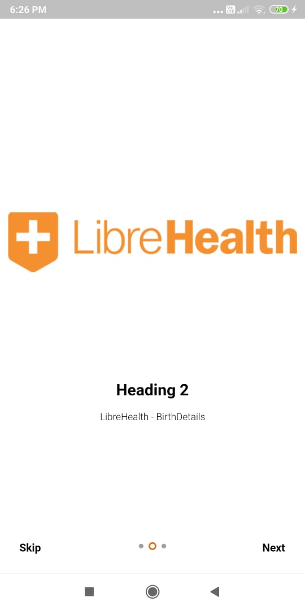
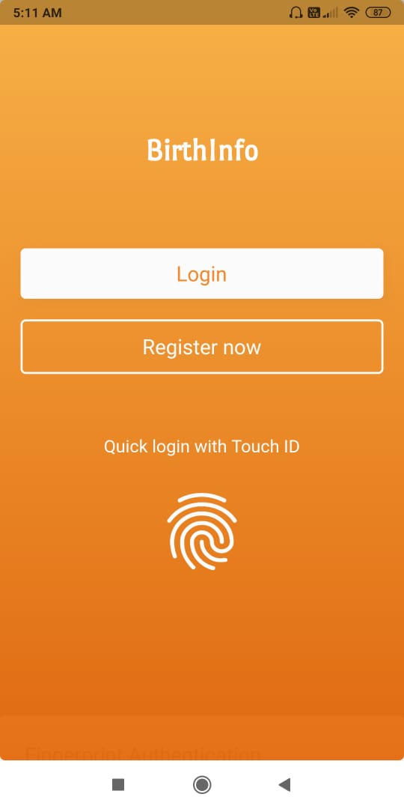
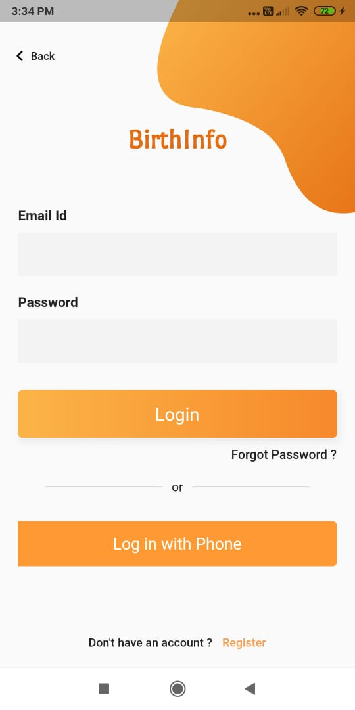
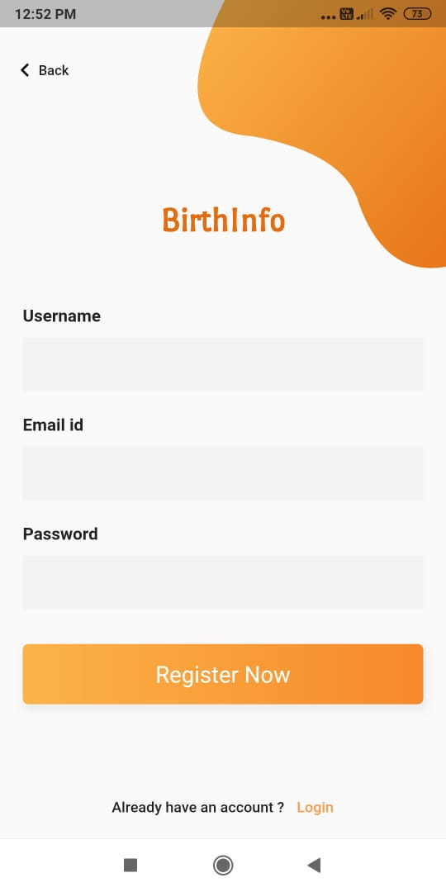
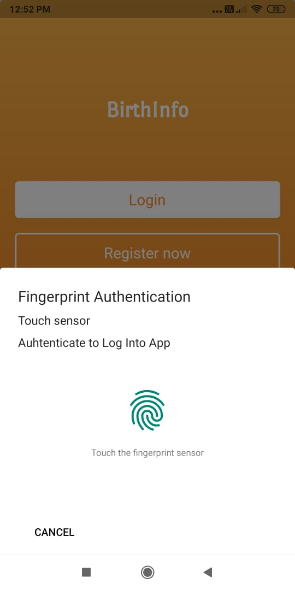
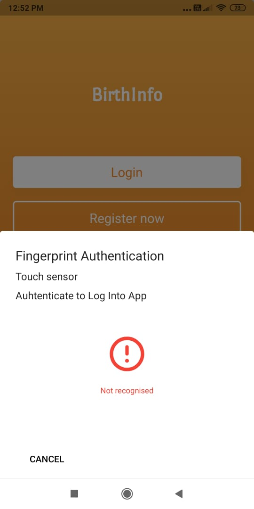
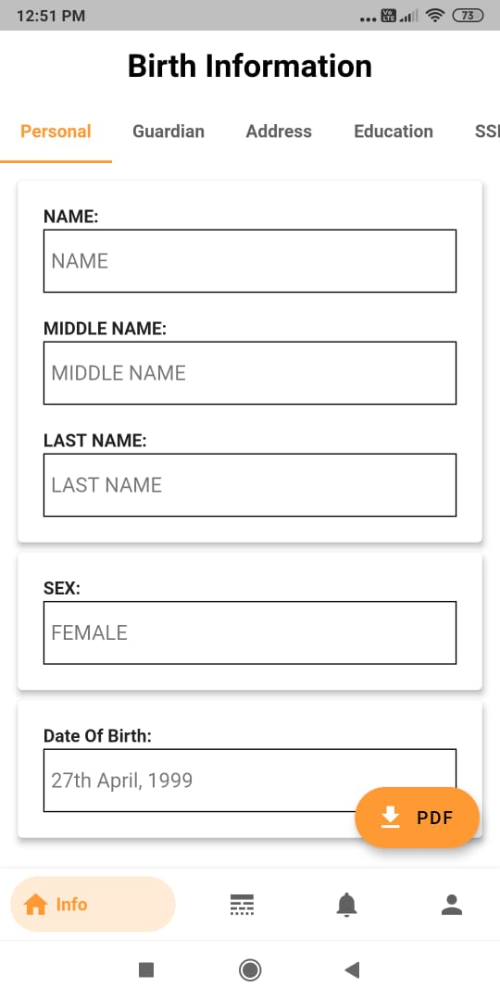
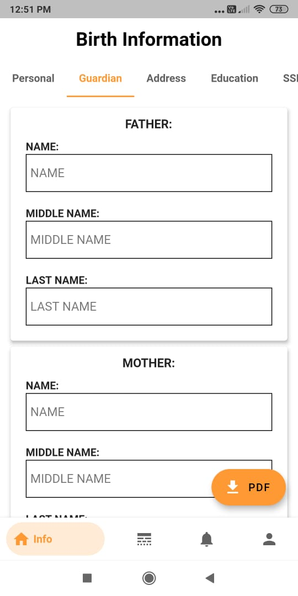
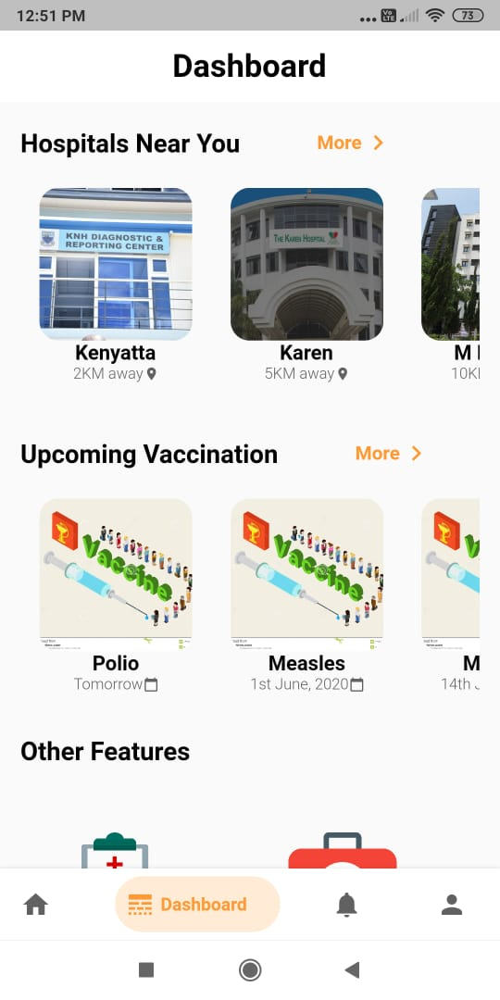
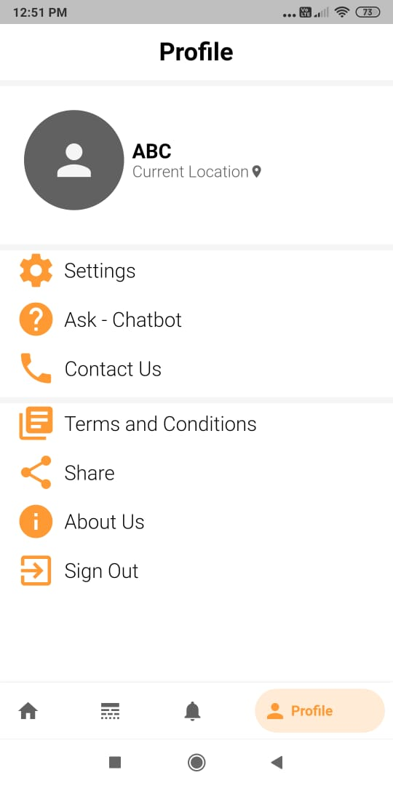

# LibreHealth_BirthDetails - GSOC 2020

## Readme

A Flutter application for parents or guardians of newborn babiy in Kenya to receive and display birth information and elements of essential newborn care, such as immunization records using the SSI model (Evernym SDK). The project comes under the LibreHealth organization for GSOC 2020.

## Table of contents

- [Readme](#readme)
    - [Table of contents](#table-of-contents)
    - [Getting Started](#getting-started)
    - [Installation](#installation)
    - [Screenshots](#screenshots)

## Getting Started

This project is created using [Flutter](https://flutter.dev/) on [Android Studio](https://developer.android.com/studio).

To run the development environment for this frontend, you need [Git](https://git-scm.com/) installed.

## Installation

Make sure you have the latest version of [Flutter SDK](https://flutter.dev/docs/get-started/install) installed.
- `git clone https://https://github.com/prajwal27/birth_register.git`
- In `cmd` move to the current project directory.
- Make sure device is connected or emulator is running (run emulator by `flutter emulators --(device name)` command).
- You can start debugging process by `flutter run` command.

For help getting started with Flutter, view the online
[documentation.](http://flutter.io/).

## ScreenShots

    

    

    

   

  
